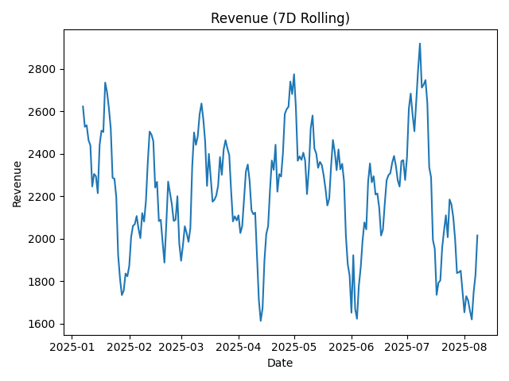
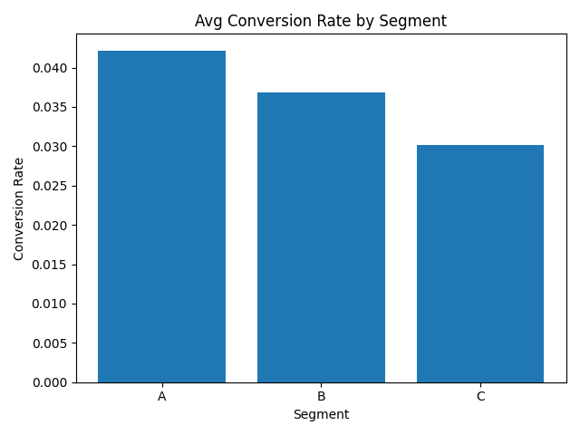
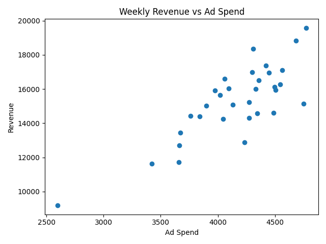
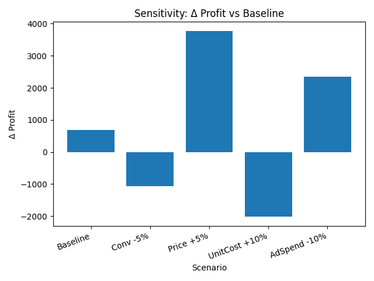

# Results & Reporting — Stakeholder Report

## Executive Summary
- Revenue trend is stable with modest seasonality.
- Segment A converts better than B and C; C is cost sensitive.
- Profit is most sensitive to conversion-rate decreases and unit-cost increases.

## Key Visuals

*7-day rolling revenue shows seasonality without structural decline.*

*Segment A leads in conversion; Segment C trails.*

*Weekly revenue generally scales with ad spend, with diminishing returns at higher spend.*

## Sensitivity Summary
Average monthly profit baseline and scenario deltas are in `sensitivity_table.csv`. The chart below shows Δ vs baseline.

## Assumptions & Risks
Assumptions: consistent attribution; stable pricing and CAC proxies; scenarios are uniform percentage shocks.
Risks: shifts in attribution windows; volatility of unit costs, especially in Segment C; segment mix changes.
Mitigations: monitor conversion quality, lock supplier pricing where possible, re-run sensitivity monthly.

## Decision Implications
- Protect conversion rate via landing-page and funnel QA; avoid cuts that degrade CR.
- Hedge unit-cost risk with supplier terms; prioritize efficiency in Segment C before scaling.
- Reallocate budget toward segments with stronger conversion until Segment C improves.

## Reproduction
Data: `../data/stage12_business_metrics.csv`
Notebook: `../notebooks/stage12_results_reporting.ipynb`
Exports: `./images/*.png`, `./sensitivity_table.csv`
